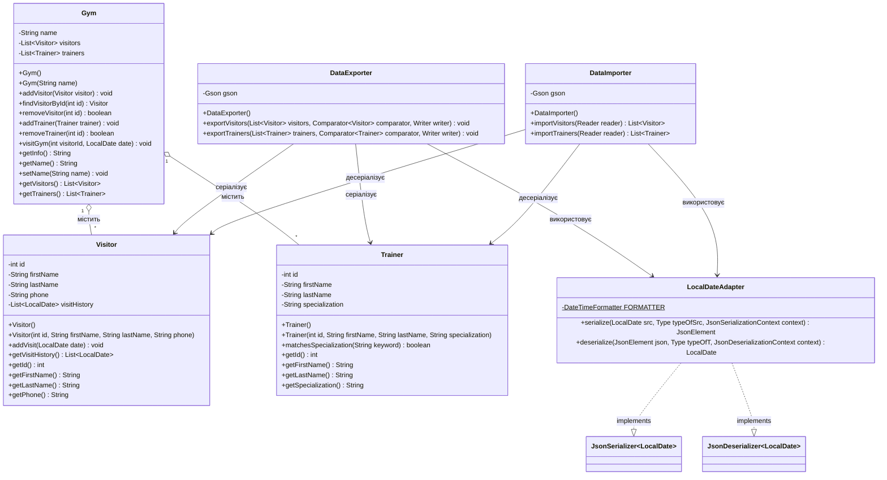

```mermaid
classDiagram
    direction TB

    class Gym {
        -String name
        -List~Visitor~ visitors
        -List~Trainer~ trainers
        +Gym()
        +Gym(String name)
        +addVisitor(Visitor visitor) void
        +findVisitorById(int id) Visitor
        +removeVisitor(int id) boolean
        +addTrainer(Trainer trainer) void
        +removeTrainer(int id) boolean
        +visitGym(int visitorId, LocalDate date) void
        +getInfo() String
        +getName() String
        +setName(String name) void
        +getVisitors() List~Visitor~
        +getTrainers() List~Trainer~
    }

    class Visitor {
        -int id
        -String firstName
        -String lastName
        -String phone
        -List~LocalDate~ visitHistory
        +Visitor()
        +Visitor(int id, String firstName, String lastName, String phone)
        +addVisit(LocalDate date) void
        +getVisitHistory() List~LocalDate~
        +getId() int
        +getFirstName() String
        +getLastName() String
        +getPhone() String
    }

    class Trainer {
        -int id
        -String firstName
        -String lastName
        -String specialization
        +Trainer()
        +Trainer(int id, String firstName, String lastName, String specialization)
        +matchesSpecialization(String keyword) boolean
        +getId() int
        +getFirstName() String
        +getLastName() String
        +getSpecialization() String
    }

    class DataExporter {
        -Gson gson
        +DataExporter()
        +exportVisitors(List~Visitor~ visitors, Comparator~Visitor~ comparator, Writer writer) void
        +exportTrainers(List~Trainer~ trainers, Comparator~Trainer~ comparator, Writer writer) void
    }

    class DataImporter {
        -Gson gson
        +DataImporter()
        +importVisitors(Reader reader) List~Visitor~
        +importTrainers(Reader reader) List~Trainer~
    }

    class LocalDateAdapter {
        -DateTimeFormatter FORMATTER$
        +serialize(LocalDate src, Type typeOfSrc, JsonSerializationContext context) JsonElement
        +deserialize(JsonElement json, Type typeOfT, JsonDeserializationContext context) LocalDate
    }

    Gym "1" o-- "*" Visitor : містить
    Gym "1" o-- "*" Trainer : містить
    DataExporter --> Visitor : серіалізує
    DataExporter --> Trainer : серіалізує
    DataExporter --> LocalDateAdapter : використовує
    DataImporter --> Visitor : десеріалізує
    DataImporter --> Trainer : десеріалізує
    DataImporter --> LocalDateAdapter : використовує
    LocalDateAdapter ..|> JsonSerializer~LocalDate~ : implements
    LocalDateAdapter ..|> JsonDeserializer~LocalDate~ : implements
```
